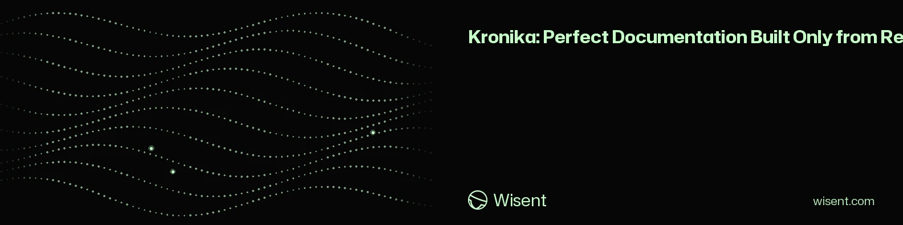

<!-- wisent-banner:start -->
<p align="center">
  
</p>
<!-- wisent-banner:end -->

<!-- wisent-readme-signals:start -->
[](https://github.com/wisent-ai/kronika) [](https://github.com/wisent-ai/kronika/issues) [](https://wisent.com) [](https://discord.gg/qRjpkthq54) [](https://www.linkedin.com/company/wisent-ai/) [](https://x.com/wisentai) [](https://calendly.com/lbartoszcze)
<!-- wisent-readme-signals:end -->

# Kronika: Perfect Documentation Built Only from Repository Truth

Automated Documentation Creator and Updater.

You ship at the speed of light — but your documentation does not follow. With
Kronika, every commit impacts your documentation and you can make sure your docs
are full of intuitive, easy-to-follow and up-to-date examples. Review your older
documentation and make sure it is easy for your users and consistent with your
code.

Never have your docs drift away from your code.

It keeps repository selection, exclusions, request signing, output confinement,
and the final write under the operator's control. Source files are evidence, not
instructions to the model.

[Documentation](https://kronika.wisent.com/docs/) ·
[Quick start](https://kronika.wisent.com/docs/quick-start/) ·
[CLI reference](https://kronika.wisent.com/docs/cli/) ·
[Library API](https://kronika.wisent.com/docs/library/) ·
[Canonical repository](https://github.com/wisent-ai/kronika)

Version `0.2.0` is public development source. The package generates one local
document at a time and reconciles a manifest of documents per repository
(`kronika sync`); multi-repository orchestration, team review, retained
versions, organization search, and supported publishing are separate future
managed-service boundaries, not capabilities of this package.

## Problem and intended users

Repository documentation becomes stale because the evidence changes faster than
manual prose and because generated prose often loses the source boundary. A
useful writer must show what enters the prompt, exclude secret-prone files, bound
payloads, prevent repository content from becoming model instructions, preview
changes, and refuse writes outside the selected repository.

Kronika serves:

- **maintainers** drafting or regenerating README and technical documentation
  from a controlled source set;
- **reviewers** inspecting selected and skipped files before any model call;
- **documentation platform operators** integrating a local engine with a
  separately operated Brama route;
- **tool developers** embedding the same selection and generation contract
  through the TypeScript API.

## Product boundaries

### Included

- Git-aware source discovery with bounded recursive fallback outside a worktree;
- deterministic prioritization of existing output, README, `docs/`, manifests,
  configuration, schemas, and application source;
- exclusion of secret-prone files, private keys, dependency trees, build output,
  recordings, lock files, and private deployment state;
- source manifest, selected byte total, and skipped-file reasons;
- one signed OpenAI-compatible Brama completion request;
- prompt rules that treat repository content as untrusted evidence and prohibit
  invented commands, APIs, configuration, and status;
- preview-only output by default;
- explicit `--apply` with an atomic rename inside the selected repository;
- CLI plus a dependency-free runtime TypeScript library package.

### Explicit non-goals

- Kronika does not prove that generated prose is correct merely because selected
  source was supplied; a maintainer must review claims and omissions.
- It does not execute repository instructions, commands, build scripts, examples,
  or generated output.
- It does not allow an output or explicit source to escape the selected
  repository.
- The current package does not persist a stable source-span provenance graph,
  freshness history, approval workflow, organization taxonomy, or retained
  document versions.
- It does not schedule repositories, publish a site, configure SSO/RBAC, or
  provide an SLA.
- Private repositories, generated customer documents, prompts, responses,
  credentials, roadmaps, and production configuration must not be published as
  package fixtures or public issues.

### Supported environment and current capability

| Surface | Requirement | Current state |
|---|---|---|
| CLI and library | Node.js 22+ | Implemented |
| Adopt existing documentation | readable Markdown in `README.md`, `docs/`, or explicit `--docs` paths | Implemented; writes only `kronika.sync.json` |
| Local source inspection | readable repository | Implemented; no model call |
| Documentation preview | Brama URL and scoped bearer; optional request-signing identity | Implemented |
| Atomic apply | writable output within repository | Implemented with explicit flag |
| Exact Git-change documentation gate | Brama URL, scoped bearer, base/head refs | Implemented |
| Stable provenance/freshness store | — | Not implemented in `0.2.0` |
| Hosted scheduling/review/publishing | managed service | Not implemented by this package |

## Core use cases

### Initialize an existing documentation workspace

- **Actor:** a maintainer bringing a repository they already document.
- **Initial state:** existing Markdown under `README.md`, `docs/`, or explicit
  repository-relative `--docs` paths.
- **Outcome:** `kronika init` validates every document and evidence path, then
  atomically writes the established `kronika.sync.json` project manifest.
- **Boundary:** no documentation is generated or changed, no repository
  command is executed, and no Brama request occurs. An identical manifest is
  unchanged; a different one is preserved as a conflict unless `--replace` is
  explicit. Invalid or escaping paths leave no partial manifest.

### Inspect the evidence boundary

- **Actor:** a maintainer or reviewer.
- **Initial state:** a local repository and optional explicit source paths.
- **Outcome:** `kronika sources` prints every selected file, total bytes, and
  skipped file with its reason.
- **Boundary:** no Brama call occurs and no repository file changes.

### Gate a code change against documentation

- **Actor:** CI or a reviewer with scoped Brama access.
- **Initial state:** one resolvable base commit and head commit in the selected
  repository.
- **Outcome:** `kronika check` audits the bounded Git diff and current
  repository sources, emits a structured verdict, and exits non-zero for
  concrete documentation blockers.
- **Boundary:** internal refactors do not require documentation churn; only
  omitted or contradictory public behavior, interfaces, configuration,
  security boundaries, and operational contracts block.

### Preview a complete document

- **Actor:** a maintainer with scoped Brama access.
- **Initial state:** selected sources, output path, instruction, model selector,
  and payload bounds are explicit.
- **Outcome:** Kronika signs one completion request and writes the candidate
  Markdown to stdout.
- **Boundary:** preview does not modify the repository; the result remains
  model-generated and requires human review against source.

### Apply a reviewed replacement

- **Actor:** a maintainer authorized to edit the target repository.
- **Initial state:** the same generation request includes `--apply` and its
  output path stays inside the repository.
- **Outcome:** Kronika atomically replaces the requested document.
- **Boundary:** applying does not run formatting, tests, deployment, publishing,
  or approval workflow.

## How Kronika works

```text
repository
   │
   ├─ git-aware discovery / explicit sources
   ├─ secret and artifact exclusions
   └─ byte and path bounds
             │
             ▼
 selected-source manifest + documentation instruction or exact Git diff
             │ scoped bearer + exact JSON body; optional HMAC
             ▼
           Brama
             │
             ├─ complete Markdown candidate
             │    ├─ stdout preview (default)
             │    └─ atomic in-repository replacement (--apply)
             └─ structured documentation verdict (check)
```

Kronika owns source selection, prompt construction, optional request signing,
output validation, and local replacement. Brama owns client authorization,
model selection, and inference. Git and the repository remain authoritative
for source and review history.

## Quick start

This safe path builds the package, adopts its existing Markdown into Kronika's
project manifest, and inspects the evidence boundary. It makes no model request
and does not generate or rewrite documentation.

### Prerequisites

- Git;
- Node.js 22 or newer;
- npm.

```bash
git clone https://github.com/wisent-ai/kronika.git
cd kronika
npm install
npm run build
node dist/src/cli.js init --repo .
node dist/src/cli.js sources --repo . --source README.md --source src
```

Expected result: `init` reports every imported document and writes only
`kronika.sync.json`; `sources` prints the selected manifest, byte total, and
skipped files with reasons. Only configure Brama after reviewing that boundary.

For local command installation:

```bash
npm link
kronika sources --repo /path/to/project
```

## Primary interfaces

### Adopt existing documents into the project manifest

```bash
kronika init --repo /path/to/project
kronika init --repo /path/to/project --docs README.md --docs handbook \
  --source src --source package.json
```

Without `--docs`, Kronika discovers Markdown under an existing `README.md` and
`docs/`. Every document receives the exact repeated `--source` paths, or `.`
when none are supplied, in schema-version-1 `kronika.sync.json`. The command
validates all selected paths before one atomic manifest write. It reports
`imported`, `unchanged`, `conflicting`, and `rejected` arrays; a conflict or
rejection exits non-zero and leaves the current manifest untouched. `--replace`
is the explicit overwrite for a conflicting manifest. Symbolic links,
non-Markdown file selections, missing paths, and paths outside the repository
are rejected. Existing documents are never copied, generated, or edited.

### Inspect sources

```bash
kronika sources \
  --repo /path/to/project \
  --source README.md \
  --source src \
  --source docs
```

Automatic discovery uses
`git ls-files --cached --others --exclude-standard`, then a bounded recursive
scan when the path is not a Git worktree.


### Check one exact change

```bash
kronika check \
  --repo /path/to/project \
  --base origin/main \
  --head HEAD \
  --json
```

The base and head are resolved to commit SHAs before the model call. Kronika
refuses an unreadable or oversized diff rather than auditing truncated evidence.
The JSON result contains the resolved SHAs, changed paths, summary, warnings,
and blocker findings. Exit status `1` means at least one blocker.

### Generate and preview

```bash
kronika write \
  --repo /path/to/project \
  --output docs/architecture.md \
  --source README.md \
  --source src \
  --instruction 'Document components, request flow, invariants, and failure modes.'
```

Add `--apply` only after confirming the selected source boundary and accepting a
complete replacement of the output file.

### Keep a repository's documentation reconciled

```bash
kronika sync --repo /path/to/project --commit --push
```

Sync reads `kronika.sync.json` — the human's declaration of which documents
are maintained from which evidence:

```json
{
  "schemaVersion": 1,
  "documents": [
    {
      "output": "docs/operations.md",
      "sources": ["src/deploy", "src/monitor"],
      "instruction": "Operator documentation; keep the existing section order."
    }
  ]
}
```

and records the last reconciled commit per document in
`kronika.sync-state.json`, committed beside it. Each run does only the work
the evidence demands: a document's first run records a baseline and generates
nothing; a run whose declared sources did not change advances nothing and
calls no model; a drifted document is audited (`check`) over a diff
restricted to its declared sources, and a passing audit IS the update — the
state advances without churn. Only an audit with blocker findings triggers a
rewrite (`write --apply`), instructed with those findings so the rewrite
corrects named defects instead of re-authoring reviewed text. `--dry-run`
audits without writing a file or the state; `--commit`/`--push` land the
reconciliation, so a scheduler (cron, launchd, `stado schedule`) can run the
same command forever and documentation follows the repository by itself.
Exit status `1` means at least one document failed to reconcile.

| Option | Purpose |
|---|---|
| `--model <selector>` | override the Brama selector |
| `--max-input-bytes <n>` | total source payload; default `200000` |
| `--max-file-bytes <n>` | one source file; default `64000` |
| `--max-tokens <n>` | completion budget; default `8000` |
| `--max-diff-bytes <n>` | complete Git diff budget for `check`; default `200000` |
| `--base <ref>` | required base commit for `check` |
| `--head <ref>` | head commit for `check`; default `HEAD` |
| `--timeout-ms <n>` | Brama request bound; default `120000` |
| `--json` | machine-readable result |
| `--apply` | atomically replace the requested output |

### Walk the first-use journey

```bash
kronika onboarding             # current screen
kronika onboarding --advance   # next screen
kronika onboarding --reset     # replay from the first screen
kronika onboarding --status    # report an existing attempt without starting one
kronika onboarding --json      # machine-readable screen
```

The journey is the definition the package ships
(`src/onboarding_first_use.json`): it starts with the Markdown already in the
repository and leads to `kronika init`. It needs no Brama route and completes
only after the canonical sync manifest is atomically written or an identical
manifest is accepted (`documentation_workspace_initialized`). Progress is one
local file under `${XDG_STATE_HOME:-~/.local/state}/kronika/onboarding.json`;
`--skip` dismisses the journey and `--reset` replays it.

### Brama configuration

```bash
export BRAMA_URL=https://brama.wisent.com
export BRAMA_API_KEY='<runtime-injected-client-bearer>'
# Optional when the Brama client identity is also bound to an agent:
export WISENT_APP_AGENT_ID=kronika
export WISENT_APP_AGENT_AUTH_SECRET='<runtime-injected-signing-secret>'
export KRONIKA_MODEL=any
```

`MODEL_ROUTER_URL` and `MODEL_ROUTER_TOKEN` are accepted as aliases for
`BRAMA_URL` and `BRAMA_API_KEY`. The bearer is always required. The agent ID and
HMAC secret are optional but must be supplied together. Never commit either
credential; materialize them through the deployment's scoped secret boundary.

## Library API

```ts
import { BramaClient, initializeDocumentationWorkspace, writeDocumentation } from "@wisent-ai/kronika";

const initialized = initializeDocumentationWorkspace({
  repo: "/path/to/project",
  manifestPath: "kronika.sync.json",
  documents: ["README.md", "docs"],
  sources: ["src", "package.json"],
});
if (initialized.status === "conflicting" || initialized.status === "rejected") {
  throw new Error(JSON.stringify(initialized));
}

const client = new BramaClient({
  url: process.env.BRAMA_URL!,
  apiKey: process.env.BRAMA_API_KEY!,
});

const result = await writeDocumentation({
  repo: "/path/to/project",
  output: "README.md",
  sources: ["src", "package.json"],
  instruction: "Write the canonical installation and API guide.",
  model: "any",
  maxInputBytes: 200_000,
  maxFileBytes: 64_000,
  maxTokens: 8_000,
  apply: false,
}, client);

process.stdout.write(result.content);
```

## Operational model

- **Configuration:** CLI/API arguments plus scoped Brama URL, bearer, optional
  request-signing identity and secret, and model selector.
- **State:** no hosted database; output and Git history remain in the selected
  repository.
- **Credentials:** bearer and optional HMAC material are runtime secrets and
  must never enter source, output, logs, or public issues.
- **Observability:** selected/skipped source manifest, byte totals, resolved
  base/head SHAs, changed paths, documentation findings, preview,
  machine-readable result, Brama errors, and Git diff after apply.
- **Recovery:** preview by default; an applied file is atomically replaced and
  should be recovered through repository version control.
- **Cost:** local inspection is free of model use; each write or check uses
  configured Brama inference. Managed repository scheduling, storage, review,
  and publishing remain responsibilities of the calling pipeline.

## Project status and support

- **Maturity:** public development package, version `0.2.0`.
- **Release surface:** compiled `dist`, README, and licence; no runtime npm
  dependencies.
- **Local contract:** source selection, bounded Brama generation, exact
  Git-change documentation checks, preview, and explicit atomic apply.
- **Managed contract:** scheduling, retained versions, organization
  search/access controls, publishing, private deployment, and SLA are provided
  by the calling pipeline rather than this package.
- **Issues:** [`wisent-ai/kronika`](https://github.com/wisent-ai/kronika/issues).
- **Security and privacy:** use private GitHub Security Advisories; never attach
  private source, generated customer documents, prompts, responses, credentials,
  roadmaps, taxonomy, or production configuration to a public issue.
- **License:** Apache License 2.0; see [`LICENSE`](LICENSE).

## Site pipeline (formerly `docs-cli`)

Beyond single-document writing, Kronika ships a documentation-site pipeline:
turn a product repository into its documentation site automatically, then hold
every page to mechanical checks before anything publishes. It is the
documentation equivalent of [landing-cli](https://github.com/wisent-ai/landing-cli):
a model authors a **typed content plan** — never markup — and everything around
the model is deterministic and verifiable.

| Stage | Owner | Artifact |
|---|---|---|
| Surface detection | [`pipeline/src/detect.mjs`](pipeline/src/detect.mjs) | `brief.json` — computed from the product repo, not decided by anyone |
| Plan authoring | model via Brama | `plan.json` conforming to [`pipeline/schemas/plan.schema.json`](pipeline/schemas/plan.schema.json) |
| Validation | [`pipeline/src/validate.mjs`](pipeline/src/validate.mjs) | pass/fail per validator, machine-readable report |
| Writing standard | [`pipeline/WRITING-STANDARD.md`](pipeline/WRITING-STANDARD.md), distilled from the 50-reference evidence set and the restored human corpus | injected into the authoring prompt |
| Emission | [`pipeline/src/emit.mjs`](pipeline/src/emit.mjs) | `DocPage` data module for `DocumentationLayout` |
| Publication | consumer site CI | deploy only on all-green |

Five validators gate the plan, each one a defect the operator caught by hand on
2026-08-19: **claims** (every `claim.evidence` occurs in its named source),
**drift** (every documented command usage line and flag exists in the live
binary's `--help`), **terms** (every recurring term has a defining page — no
"fleet was never defined"), **structure** (closed page kinds; no Boundaries
kind exists to choose), and **coverage** (every completion-gate kind that
`brief.json` says applies is present).

Commands: `npm run docs:detect` · `npm run docs:validate` · `npm run docs:emit`
(or the `docs-cli` binary). Model access resolves through Brama only —
`BRAMA_URL`, then the local Stado resolver's brama adapter; there is no
provider fallback. There is no quality judge and no scoring step: the
writing standard is what the author reads, the mechanical validators are
what the build enforces, and publication follows the consuming site's CI.

The writing standard itself was written by reading exactly its two named
sources — the 50-reference evidence set in Spis and our own previous
documentation (the restored February corpus). When either source changes,
the standard changes with it.

The writing standard for everything this pipeline produces is the operator's
restored human-written corpus (the February 2026 Wisent documentation, now
live at `ster.wisent.com/docs`) together with the 50-reference evidence set in
`product-guidelines/documentation-site-examples/`: same page kinds, same
anatomy, same sourcing discipline. The validators below enforce that bar
mechanically because the author here is a model.
